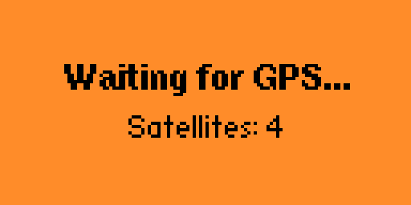
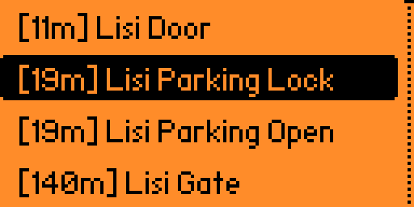

# Nearby Files

[](https://lab.flipper.net/apps/nearby_files)
[](https://github.com/Stichoza/flipper-nearby-files/releases/latest)

A GPS-enabled file browser for Flipper Zero that displays SubGHz, NFC, and RFID files sorted by distance from your current location.

  

<details>
  <summary>Show Preview</summary>
  
</details>


> [!Tip]
> Check out **[flipper-map.stichoza.com](https://flipper-map.stichoza.com)** for a web version of this app. Visualize files on a map in your browser.

## Features

- **GPS Integration**: Uses real GPS coordinates to calculate distances to files
- **Multi-format Support**: Scans `.sub`, `.nfc`, and `.rfid` files from standard directories
- **Distance-based Sorting**: Files are sorted by proximity to your current GPS location
- **Smart Filtering**: Only displays files containing GPS coordinates
- **Distance Display**: Shows distance to each file (e.g., [45m], [1.3km], [23km])
- **Direct Launch**: Click any file to launch the appropriate app (SubGHz, NFC, or RFID)

## Installation

The app comes bundled with [Unleashed](https://flipperunleashed.com/) firmware (extra apps pack) and [Momentum](https://momentum-fw.dev/). If you're using any other firmware, you can install by any of following ways:

### Option 1: Install from Flipper App Catalog

1. Go to [lab.flipper.net](https://lab.flipper.net/apps/nearby_files) and search for **Nearby Files**.
2. Connect your Flipper Zero to your PC or laptop using USB cable.
3. Click **Install**.

### Option 2: Install from File
Install from **[releases](https://github.com/Stichoza/flipper-nearby-files/releases/latest)** (stable builds) or **[workflows](https://github.com/Stichoza/flipper-nearby-files/actions/workflows/build.yml)** (development builds).

1. Choose which version you would like to install.
   - For stable builds, go to [latest release](https://github.com/Stichoza/flipper-nearby-files/releases/latest) page.
   - For development builds, go to [build workflow](https://github.com/Stichoza/flipper-nearby-files/actions/workflows/build.yml) and select latest build.
4. Download file corresponding to your firmware version. The FAP file is built for the Official Firmware (both release and development versions) and for Momentum and Unleashed custom firmwares (files with `-unlshd` and `-mntm` suffixes).
5. Extract `nearby_files.fap` from the ZIP file to the `apps/GPIO` folder on your Flipper Zero SD card.

### Option 3: Build from Source

If you're building from source, you most pobably know what to do and how.

## Usage

### Requirements
- GPS module connected via GPIO pins.
- SD card with SubGHz/NFC/RFID files containing GPS coordinates.

### GPS Waiting Screen
The app waits for a valid GPS fix before scanning files. You'll see:
- **No GPS Module** – if no GPS hardware is detected.
- **Waiting for GPS...** – when looking for GPS.
- **Calculating distances...** – when calculating distances to files.

### File List
Once GPS coordinates are acquired, the app scans and displays files sorted by distance:
- Files with GPS coordinates are shown with distance indicators.
- Files without coordinates are excluded from the list.
- Click any file to launch the respective app.

### Menu Options
Press Back in the file list to access:
- **Refresh List**: Re-scan files with updated GPS position
- **About**: App information and version details

> [!Important]
> File list is not automatically recalculated unless you click "Refresh List" in the menu. The reason is to avoid choosing wrong file when the list suddenly updates right before you click.

## Hardware Setup

Connect a GPS module to your Flipper Zero using the GPIO pins.

| GPS | Flipper      |
|-----|--------------|
| VCC | 3.3V (Pin 9) |
| GND | GND (Pin 11) |
| TX  | RX (Pin 14)  |
| RX  | TX (Pin 13)  |

> [!Tip]
> GPS module wiring is well described in [ezod/flipperzero-gps](https://github.com/ezod/flipperzero-gps?tab=readme-ov-file#hardware-setup) repository.

## File Requirements

Files must contain GPS coordinates in one of these formats:

```yml
Lat: 41.123456
Lon: 44.123456
```

> [!Note]
> `Latitude` and `Longitude` keywords are also supported. `Latitute` (typo) is also supported for legacy reasons.

These coordinates are **automatically** added to SubGHz files if you're using a custom firmware (like Momentum or RogueMaster) that has "subdriving" feature – recording location from GPS module at the time of signal capture. You can also manually add coordinates by editing the file either via Flipper mobile app or directly on SD card.

Currently there are no apps or firmware that adds GPS data to NFC and RFID files, but you can always add coordinates to those files manually. Useful for location specific cards, like work badges, apartment access cards, elevator badges, etc.

> [!Warning]
> If your Flipper is crashing or rebooting while running GPS related apps, try setting `Listen UART` to `None` in Flipper settings.
> Source: https://github.com/flipperdevices/flipperzero-firmware/issues/4081#issuecomment-2631762477
